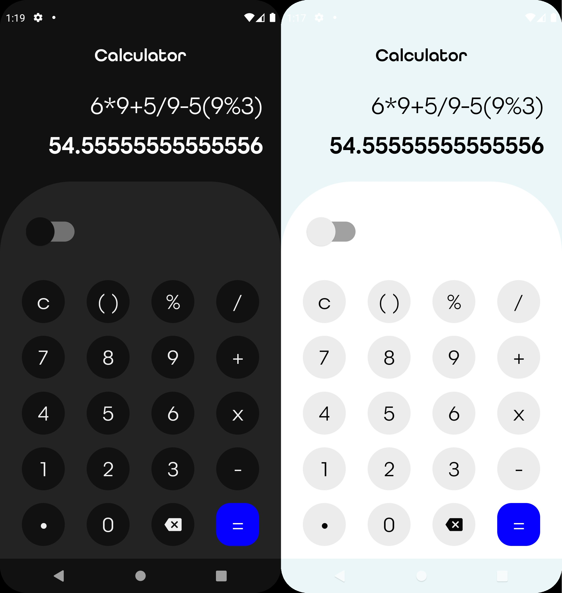

# Compose Calculator

This is just a small that I am building to start learning how to build my app UI using Jetpack compose.
The app supports both Light and Dark mode

## Screens

## Credits
My UI inspiration came from this Behance project by **Oluwaseyi Akeredolu**
[Behance](https://www.behance.net/gallery/144791151/Daily-UI-Challenge-004?tracking_source=search_projects%7Ccalculator)

##Todo
- Toggle between Light and Dark Mode from the app
- Enhance the app to solve scientific problems